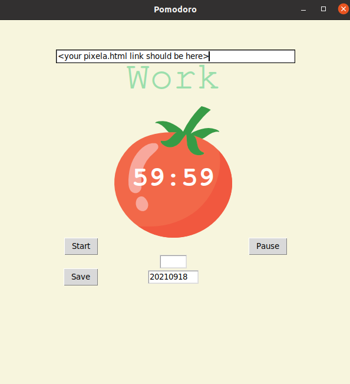

# Pomodoro App

Pomodoro App build with Python and the https://pixe.la/ API. The app is built with tkinter to build GUI with Python and I add a nice feature that once you finished your studies for the day you can press the "save" button and will send a POST request to the pixel.la graph that you create with the pixela.py script.

Pomodoro App




Pixel.la


## Built With
- Python
- pixe.la API

### Python packages

- tkinter
- math
- requests
- datetime
- os


### Documentation

- https://docs.pixe.la/


## Author

- 👤GitHub: [Jose Abel Ramirez](https://github.com/jose-Abel)
- Linkedin: [Jose Abel Ramirez Frontany](https://www.linkedin.com/in/jose-abel-ramirez-frontany-7674a842/)


## Getting Started

To download the project either can do it with with git clone command:

git clone <repository_link>

Open the pixela.py script first to set up some variables:

```
	USERNAME = "WRITE AN USERNAME"
	TOKEN = "WRITE UP ANY MADE UP TOKEN ID OF AT LEAST 18 CHARACTERS"
	GRAPH_ID = "WRITE A GRAPH ID"
	YELLOW = "#f7f5dd"
	RED = "#e7305b"
	GREEN = "#9bdeac"
	FONT_NAME = "Courier"
	PIXELA_ENDPOINT = "https://pixe.la/v1/users"
```


After setting up those variables, run:

```
	pixela.py
```

You should get a message like this in the console:

```
	{"message":"Success. Let's visit https://pixe.la/@<username>, it is your profile page!","isSuccess":true}
	https://pixe.la/v1/users/<username>/graphs
	{"message":"Success.","isSuccess":true}
	Your pixel endpoint is https://pixe.la/v1/users/<username>/graphs/<graph_id>.html
```


Copy the pixel endpoint and your TOKEN and open main.py and change those 2 variables:

```
	graph = ""
	TOKEN = ""
```

For the graph variable paste the pixel endpoint without the .html

After all the setup, run 

```
	./main.py
```

## 📝 License

This project is MIT licensed.

## Show your support

Give a ⭐️ if you like this project!
